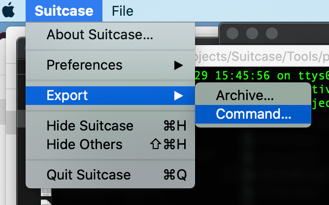

# Suitcase

A flexible command line tool for instantly deploying user interfaces for simple commands and scripts. 

## Command-Line Utility

### Usage

	OVERVIEW: A flexible command line tool for instantly deploying user interfaces
	for simple commands and scripts.

	USAGE: Suitcase <subcommand>

	OPTIONS:
	  --version               Show the version.
	  -h, --help              Show help information.

	SUBCOMMANDS:
	  basic                   Launch a basic Suitcase process, that has a main menu
							  and an icon in the Dock when running.
	  utility                 Launch a utility Suitcase process, without a Dock
							  icon or main menu.

#### Suitcase `basic`

A `basic` Suitcase process has a [main menu](https://developer.apple.com/documentation/appkit/nsapplication/menus) and an [icon in the Dock](https://developer.apple.com/documentation/appkit/nsdocktile) when running.

See the [full documentation](./Basic.md).

#### Suitcase utility

A `utility` Suitcase process does not have a Dock icon or main menu. It consists of just a [main window](https://developer.apple.com/documentation/appkit/nswindow).

See the [full documentation](./Utility.md).

### Export as a `.command`

Any Suitcase command can be exported as a self running `.command` file. You can double click this file to launch or share.



### Simple Examples

These examples are very basic but should give you a good idea of how you can use Suitcase. If you have any questions please [create an issue](https://github.com/Impedimenta/Suitcase/issues). 

If you create an example you'd like to share [open a PR at the Bazaar](https://github.com/Impedimenta/Suitcase-Bazaar).

#### Hello World

A simple example consisting of one button that when clicked calls the `say` command. 

```bash
Suitcase --name="Demo App" --window-title="Hello World" \\
	--window-width="200" --window-height="200" \
	--control-type="label" --control-title="Give a face to every voice…" \
	--control-type="button" \
	--control-title="🗣 Say hello" \
	--control-action="/usr/bin/say Hello World"
```

[](https://vimeo.com/413136057)

*Click the .gif to see a skippable video.*

#### Menus

This example shows how to create menus and sub-menus. Actions can be attached to any menu item the same way as `button`s.

Menu items can also be assigned a keyboard shortcut. See the [full documentation](./Basic.md) for more details. 

```bash
Suitcase --name="Demo App" --window-title="Menus" \
	--control-title="UUID" \
		--control-type="label" --control-identifier="com.label.uuid" \
	--menu-title="Action>Generate>UUID" \
		--menu-action="/usr/bin/uuidgen" \
			--menu-action-destination="com.label.uuid" \
	--menu-title="Action>Copy UUID" \
	--menu-shortcut="k" \
	--menu-action="/usr/bin/printenv com.label.uuid | /usr/bin/pbcopy"
```

[](https://vimeo.com/413141354)

*Click the .gif to see a skippable video.*

#### Hidden Files & Folders

This is a more involved example that uses `defaults` to read the macOS user defaults system and use `sed` to set a state `label`.

This is how the command would be run in Terminal.

```bash
$ defaults read com.apple.finder AppleShowAllFiles | sed 's/1/Visible/g;s/0/Hidden/g'
```

The button uses `&` to run two commands, one to write to the user defaults and the second to relaunch the Finder:

```bash
$ defaults write com.apple.finder AppleShowAllFiles -bool TRUE
```

Kill the Finder and relaunch:

```bash
$ killall Finder
```

```bash
Suitcase --name="Hidden Finder Settings" \
	--control-title="Hidden Files & Folders:" \
		--control-group-identifier="com.finder.hidden" \
		--control-type="label" \
	--control-title="unknown" \
		--control-group-identifier="com.finder.hidden" \
		--control-type="label" \
	--control-identifier="com.label.hidden.state" \
	--control-title="Refresh" \
		--control-group-identifier="com.finder.hidden" \
		--control-type="button" \
		--control-action="/usr/bin/defaults read com.apple.finder AppleShowAllFiles | /usr/bin/sed s/1/Visible/g;s/0/Hidden/g" \
		--control-action-destination="com.label.hidden.state" \
	--control-title="Enable" \
		--control-type="button" \
		--control-group-identifier="com.finder.hidden.buttons" \
		--control-action="/usr/bin/defaults write com.apple.finder AppleShowAllFiles -bool TRUE & /usr/bin/killall Finder" \
	--control-title="Disable" \
		--control-type="button" \
		--control-group-identifier="com.finder.hidden.buttons" \
		--control-action="/usr/bin/defaults write com.apple.finder AppleShowAllFiles -bool FALSE & /usr/bin/killall Finder"
```


*Click the .gif to see a skippable video.*

## Bug Reports & Feature Requests

Please [create an issue](https://github.com/Impedimenta/Suitcase/issues).

## Contact

Richard Stelling ([@rjstelling](https://twitter.com/rjstelling))

## Thanks to

- [Dave Verwer](https://github.com/daveverwer) at [iOS Dev Weekly](https://iosdevweekly.com)