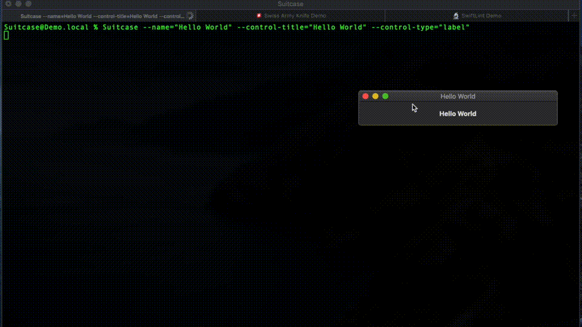
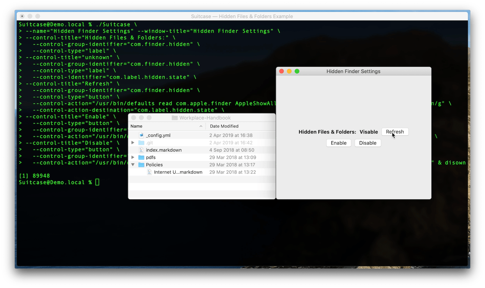

# Suitcase

*A flexible command line tool for instantly deploying user interfaces for simple commands and scripts.*

[](https://github.com/Impedimenta/Suitcase/releases)   

Suitcase is a command line tool that can be *"programmed"* to display a [SwiftUI](https://developer.apple.com/xcode/swiftui/) interface that can trigger commands and scripts. 

[🧳 Suitcase Direct Download](https://github.com/Impedimenta/Suitcase/releases/latest/download/Suitcase.dmg)

It's similar to [Shortcuts](https://apps.apple.com/us/app/shortcuts/id915249334), but for macOS and driven by the command line.



### First Class Mac Citizen 

Because of its [SwiftUI](https://developer.apple.com/xcode/swiftui/) underpinnings Suitcase is a first class Mac citizen. With out of the box support for, [Dark Mode](https://support.apple.com/en-gb/HT208976), [Menubars](https://developer.apple.com/design/human-interface-guidelines/macos/menus/menu-bar-menus/) and [Drag and Drop](https://developer.apple.com/design/human-interface-guidelines/macos/user-interaction/drag-and-drop/). 

### Powerful 

Its power and flexibility come form the tried and trusted UNIX command line. Anything you can do in Terminal you can do in Suitcase, but with a UI and export the command as a `.command` file, to check in with a project or [share with the world](https://github.com/Impedimenta/Suitcase-Bazaar).

## Information

- [@SuitcaseCLI](https://twitter.com/SuitcaseCLI) — Regular posts about updates and examples
- [The Bazaar](https://impedimenta.github.io/Suitcase-Bazaar) — Examples and documentation 
- [Impedimenta](https://impedimenta.github.io/) — Blog posts, links and related projects
- [@ImpedimentaCode](https://twitter.com/ImpedimentaCode) — Infrequent posts about other projects and tools
- [@rjstelling](https://twitter.com/rjstelling) — Frequent, irrelevant mostly technology and politics, open DMs

## Command-Line Utility

### Usage

	OVERVIEW: A flexible command line tool for instantly deploying user interfaces
	for simple commands and scripts.

	USAGE: Suitcase <subcommand>

	OPTIONS:
	  --version               Show the version.
	  -h, --help              Show help information.

	SUBCOMMANDS:
	  basic                   Launch a basic Suitcase process, that has a main menu
				  and an icon in the Dock when running.
	  utility                 Launch a utility Suitcase process, without a Dock
				  icon or main menu.

#### Suitcase `basic`

A `basic` Suitcase process has a [main menu](https://developer.apple.com/documentation/appkit/nsapplication/menus) and an [icon in the Dock](https://developer.apple.com/documentation/appkit/nsdocktile) when running.

See the [full documentation](./Basic.md).

#### Suitcase utility

A `utility` Suitcase process does not have a Dock icon or main menu. It consists of just a [main window](https://developer.apple.com/documentation/appkit/nswindow).

See the [full documentation](./Utility.md).

### Examples

These examples are very basic but should give you a good idea of how you can use Suitcase. More details examples can be found at the [Bazaar](https://impedimenta.github.io/Suitcase-Bazaar/Examples/). If you have any questions please [create an issue](https://github.com/Impedimenta/Suitcase/issues). If you create a command and you'd like to share it, [open a PR at the Bazaar](https://github.com/Impedimenta/Suitcase-Bazaar).

#### Hello World

[](https://vimeo.com/413136057)

A simple example consisting of one button that when clicked calls the `say` command. [Watch the video of this example in action](https://vimeo.com/413136057), there is a [detailed `say` example](https://impedimenta.github.io/Suitcase-Bazaar/Examples/Say.html) at the [Suitcase Bazaar](https://github.com/Impedimenta/Suitcase-Bazaar/).

<details><summary><b>📝 Code</b></summary>

```bash
$ Suitcase --name="Demo App" --window-title="Hello World" \
  --window-width="200" --window-height="200" \
  --control-type="label" --control-title="Give a face to every voice…" \
  --control-type="button" \
  --control-title="🗣 Say hello" \
  --control-action="/usr/bin/say Hello World"
```
</details>
	
#### War Games


A more advanced example using buttons and passing parameters to the `say` command. A [detailed explanation of War Games](https://impedimenta.github.io/Suitcase-Bazaar/Examples/WarGames.html) can be found at the [Suitcase Bazaar](https://github.com/Impedimenta/Suitcase-Bazaar/).

<details><summary><b>📝 Code</b></summary>

```bash
$ Suitcase --name="War Games" \
 --control-title="Shall we play a game?" \
	--control-type="text-field" \
	--control-identifier="say.textfield" \
  --control-title="Daniel" \
	--control-type="button" \
	--control-group-identifier="g.btns" \
	--control-action="/usr/bin/say" \
	--control-action-parameter="-v,Daniel,say.textfield" \
  --control-title="Samantha" \
	--control-type="button" \
	--control-group-identifier="g.btns" \
	--control-action="/usr/bin/say" \
	--control-action-parameter="-v,Samantha,say.textfield" \
  --control-title="Veena" \
	--control-type="button" \
	--control-group-identifier="g.btns" \
	--control-action="/usr/bin/say" \
	--control-action-parameter="-v,Veena,say.textfield"
```
</details>

#### Menus

[](https://vimeo.com/413141354)

This example shows how to create menus and sub-menus. Actions can be attached to any menu item the same way as `button`s. [Watch the video of this example in action.](https://vimeo.com/413141354)

Menu items can also be assigned a keyboard shortcut. See the [full documentation](./Basic.md) for more details. 

<details><summary><b>📝 Code</b></summary>
	
```bash
$ Suitcase --name="Demo App" --window-title="Menus" \
  --control-title="UUID" \
	--control-type="label" --control-identifier="com.label.uuid" \
  --menu-title="Action>Generate>UUID" \
	--menu-action="/usr/bin/uuidgen" \
	--menu-action-destination="com.label.uuid" \
  --menu-title="Action>Copy UUID" \
  --menu-shortcut="k" \
  --menu-action="/usr/bin/printenv com.label.uuid | /usr/bin/pbcopy"
```
</details>

#### Hidden Files & Folders

[](https://vimeo.com/413199912)

This is a more involved example that uses `defaults` to read the macOS user defaults system and use `sed` to set a state `label`. [Watch the video of this example in action.](https://vimeo.com/413199912)

<details><summary><b>📝 Code</b></summary>
	
```bash
$ Suitcase --name="Hidden Finder Settings" \
  --control-title="Hidden Files & Folders:" \
	--control-group-identifier="com.finder.hidden" \
	--control-type="label" \
  --control-title="unknown" \
	--control-group-identifier="com.finder.hidden" \
	--control-type="label" \
	--control-identifier="com.label.hidden.state" \
  --control-title="Refresh" \
	--control-group-identifier="com.finder.hidden" \
	--control-type="button" \
	--control-action="/usr/bin/defaults read com.apple.finder AppleShowAllFiles | /usr/bin/sed s/1/Visible/g;s/0/Hidden/g" \
	--control-action-destination="com.label.hidden.state" \
  --control-title="Enable" \
	--control-type="button" \
	--control-group-identifier="com.finder.hidden.buttons" \
	--control-action="/usr/bin/defaults write com.apple.finder AppleShowAllFiles -bool TRUE & /usr/bin/killall Finder" \
  --control-title="Disable" \
	--control-type="button" \
	--control-group-identifier="com.finder.hidden.buttons" \
	--control-action="/usr/bin/defaults write com.apple.finder AppleShowAllFiles -bool FALSE & /usr/bin/killall Finder"
```
</details>

This is how the command would be run in Terminal.

```bash
$ defaults read com.apple.finder AppleShowAllFiles | sed 's/1/Visible/g;s/0/Hidden/g'
```

The button uses `&` to run two commands, one to write to the user defaults and the second to relaunch the Finder:

```bash
$ defaults write com.apple.finder AppleShowAllFiles -bool TRUE
```

Kill the Finder and relaunch:

```bash
$ killall Finder
```

## Suitcase

### Export as a `.command`

Any Suitcase command can be exported as a self running `.command` file. You can double click this file to launch the Suitcase or share the file (it's just plain text).


## Bug Reports & Feature Requests

Please [create an issue](https://github.com/Impedimenta/Suitcase/issues).

## Contact

Releases and News ([@SuitcaseCLI](https://twitter.com/SuitcaseCLI))
Richard Stelling ([@rjstelling](https://twitter.com/rjstelling))

## Thanks to

- [Dave Verwer](https://github.com/daveverwer) at [iOS Dev Weekly](https://iosdevweekly.com)
